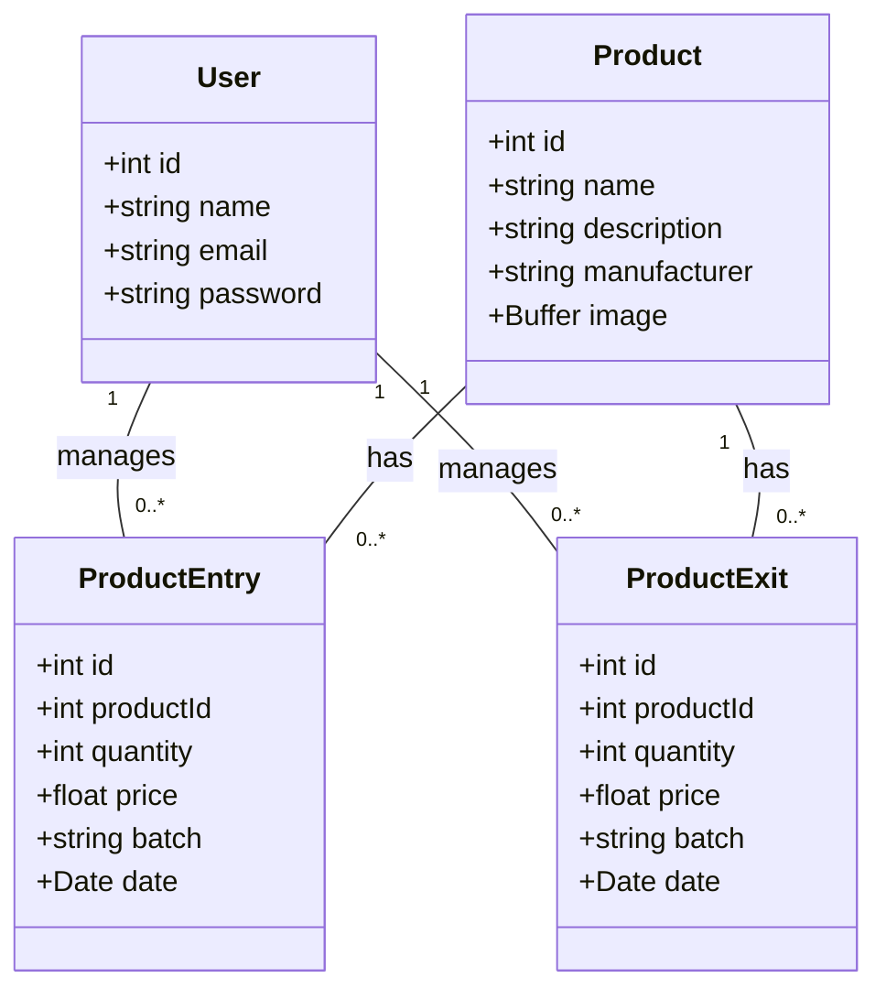
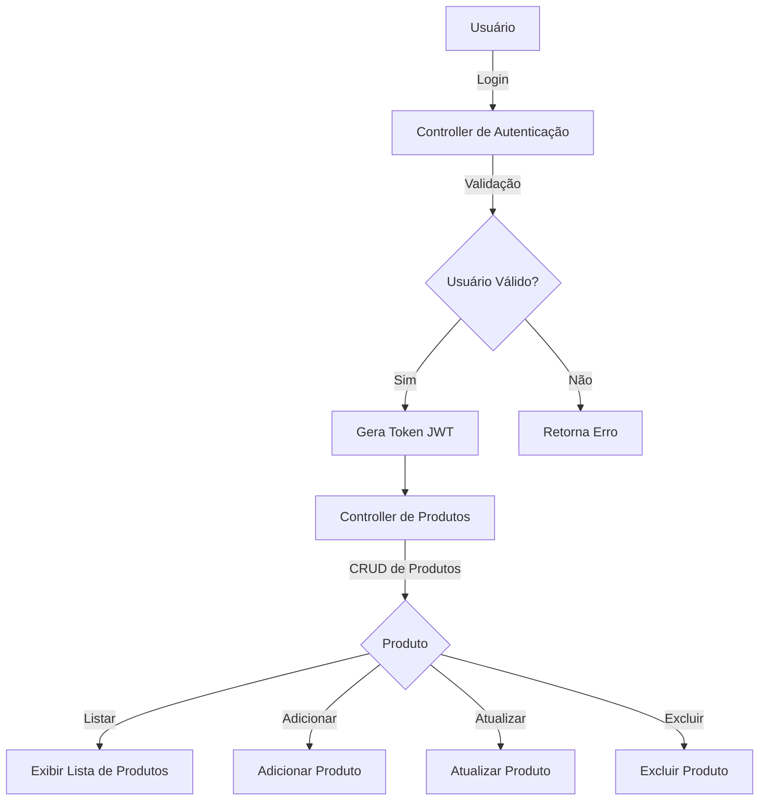

# Stock Manager API

## Descrição
Esta é uma API para gerenciamento de estoque de produtos, permitindo operações de entrada e saída de produtos, autenticação de usuários e gerenciamento de informações do produto.

## Tecnologias
- Node.js
- TypeScript
- Express
- Sequelize (ORM)
- MySQL
- JWT para autenticação

## Clonagem do Repositório
Para clonar este repositório, utilize o seguinte comando:

```bash
git clone https://github.com/RafaelRodrigues44/stockManagementBack.git
```

## Instalação das Dependências
Após clonar o repositório, navegue até o diretório do projeto e instale as dependências:

```bash
cd src
npm i
```

## Configuração do Banco de Dados
Crie um arquivo `.env` na raiz do projeto com as seguintes variáveis de ambiente:

```
DB_HOST=localhost
DB_USER=manager     
DB_PASSWORD=manager  
DB_DATABASE=stockmanager  

JWT_SECRET=abc123
PORT=4000
```

## Executando o Docker
Certifique-se de ter o Docker instalado. Abra um novo terminal e execute o seguinte comando para iniciar o banco de dados:

```bash
docker-compose up -d
```

## Iniciando a API
Em um terminal separado, inicie a API:

```bash
cd src
```

```bash
npx ts-node serve.ts
```

## Endpoints da API

### Autenticação
- `POST /api/auth/login`
  - **Descrição:** Realiza login e retorna um token JWT.
  - **Corpo da Requisição:**
    ```json
    {
      "email": "string",
      "password": "string"
    }
    ```

### Usuários
- `POST /api/users`
  - **Descrição:** Cria um novo usuário.
  - **Corpo da Requisição:**
    ```json
    {
      "name": "string",
      "email": "string",
      "password": "string"
    }
    ```

- `GET /api/users`
  - **Descrição:** Retorna a lista de usuários.

- `GET /api/users/:id`
  - **Descrição:** Retorna um usuário específico pelo ID.

- `PUT /api/users/:id`
  - **Descrição:** Atualiza informações de um usuário.
  - **Corpo da Requisição:**
    ```json
    {
      "name": "string",
      "email": "string",
      "password": "string" (opcional)
    }
    ```

- `DELETE /api/users/:id`
  - **Descrição:** Exclui um usuário pelo ID.

### Produtos
- `POST /api/products`
  - **Descrição:** Cria um novo produto.
  - **Corpo da Requisição:**
    ```json
    {
      "name": "string",
      "description": "string",
      "manufacturer": "string",
      "image": "file" (opcional)
    }
    ```

- `GET /api/products`
  - **Descrição:** Retorna a lista de produtos.

- `GET /api/products/:id`
  - **Descrição:** Retorna um produto específico pelo ID.

- `PUT /api/products/:id`
  - **Descrição:** Atualiza informações de um produto.
  - **Corpo da Requisição:**
    ```json
    {
      "name": "string",
      "description": "string",
      "manufacturer": "string",
      "image": "file" (opcional)
    }
    ```

- `DELETE /api/products/:id`
  - **Descrição:** Exclui um produto pelo ID.

### Gerenciamento de Estoque
- `POST /api/products/manage/entry`
  - **Descrição:** Registra uma entrada de produto no estoque.
  - **Corpo da Requisição:**
    ```json
    {
      "productId": "integer",
      "quantity": "integer",
      "price": "float",
      "batch": "string"
    }
    ```

- `GET /api/products/manage/entry`
  - **Descrição:** Retorna a lista de entradas de produtos.

- `POST /api/products/manage/exit`
  - **Descrição:** Registra uma saída de produto do estoque.
  - **Corpo da Requisição:**
    ```json
    {
      "productId": "integer",
      "quantity": "integer",
      "price": "float",
      "batch": "string"
    }
    ```

- `GET /api/products/manage/exit`
  - **Descrição:** Retorna a lista de saídas de produtos.

### Estoque
- `GET /api/stock`
  - **Descrição:** Retorna informações sobre o total de estoque.

- `GET /api/stock/inventory`
  - **Descrição:** Retorna dados detalhados do inventário.

## Diagrama de Classes



## Fluxo do Software



## Funções

### Controllers

- **authController.ts**
  - `validateLogin`: Valida os dados de login.
  - `login`: Processa o login e gera um token JWT.

- **productManagerController.ts**
  - `validateCreateEntry`: Valida os dados de entrada do produto.
  - `validateCreateExit`: Valida os dados de saída do produto.
  - `createEntry`: Cria uma entrada de produto no estoque.
  - `createExit`: Cria uma saída de produto do estoque.
  - `getEntries`: Retorna todas as entradas de produtos.
  - `getExits`: Retorna todas as saídas de produtos.

- **productController.ts**
  - `createProduct`: Cria um novo produto.
  - `getProducts`: Retorna todos os produtos.
  - `updateProduct`: Atualiza as informações de um produto.
  - `deleteProduct`: Exclui um produto.
  - `getProductById`: Retorna um produto específico.

- **userController.ts**
  - `createUser`: Cria um novo usuário.
  - `getUsers`: Retorna todos os usuários.
  - `updateUser`: Atualiza as informações de um usuário.
  - `deleteUser`: Exclui um usuário.
  - `getUserId`: Retorna um usuário específico.

### Services

- **stockService.ts**
  - `calculateTotalStock`: Calcula o total de estoque e retorna as informações detalhadas.
  - `calculateStockByProductId`: Calcula o estoque de um produto específico.
  - `inventoryData`: Retorna os dados do inventário formatados.

### Middleware

- **authMiddleware.ts**
  - `authMiddleware`: Middleware que verifica a autenticidade do token JWT.

## Configuração do Banco de Dados

A configuração do banco de dados é feita no arquivo `database.ts`, que se conecta ao MySQL usando as variáveis definidas no arquivo `.env`.

---
## Desenvolvedor 

- Rafael Rodrigues 
    
    email: rafael.rodrigues85@hotmail.com


Direitos de Uso

Este software é uma POC - Prova de Conceitos e é fornecido "como está". Não deve ser utilizado para fins comerciais. A redistribuição ou modificação deste software sem autorização prévia é proibida.

Qualquer ideia de alterações e melhorias será bem-vinda!
